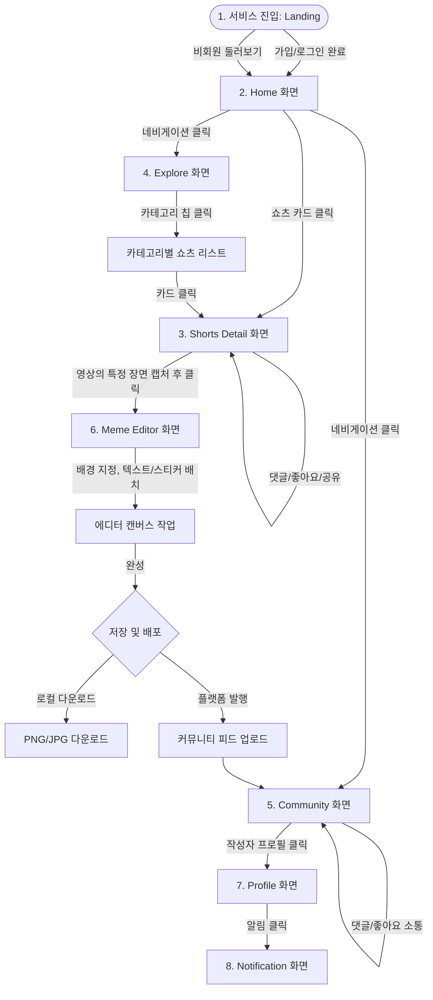

# MemePop - Product Requirement Document (PRD)

본 문서는 숏폼 콘텐츠 아카이빙 및 2차 창작 밈(Meme) 제작 플랫폼 **MemePop**의 실제 서비스 구현 및 디자인을 위한 기획 및 제품 요구사항 정의서(PRD)입니다.

---

## 1. 프로젝트 소개
* **서비스명**: MemePop (밈팝)
* **서비스 한 줄 소개**: 유튜브 쇼츠, 인스타그램 릴스, 틱톡 등 숏폼 콘텐츠를 북마크 및 탐색하고, 원하는 장면을 손쉽게 밈(Meme)으로 조립/제작하여 공유하는 플레이그라운드 엔터테인먼트 SNS.
* **서비스 성격**: Pinterest(이미지 큐레이션 및 수집) + TikTok(숏폼 소비) + Instagram(소셜 피드) + Reddit(커뮤니티 및 드립) + Imgflip(빠른 밈 에디터)의 강점들을 유기적으로 결합한 Gen Z 타겟의 새로운 놀이터.
* **디자인 컨셉**: 네오 브루탈리즘(Neo-Brutalism) 기반의 팝 아트 감성. 굵은 검은색 테두리, 채도 높은 컬러 블록, 스티커 스타일의 UI, 귀여운 오리지널 캐릭터와 경쾌하고 리드미컬한 인터랙션을 중심으로 하여 "보는 순간 재미있다"는 감정을 전달합니다.

---

## 2. 문제 정의 (Problem Definition)
1. **휘발되는 숏폼 콘텐츠**: 유저들은 매일 엄청난 양의 숏폼을 보지만, "웃기다"라고 느낀 프레임이나 장면은 그대로 흘러가 버립니다. 나중에 짤방으로 쓰기 위해 스크린샷을 찍거나 북마크해도 관리하기가 불편합니다.
2. **2차 창작의 높은 진입 장벽**: 숏폼 영상의 한 장면을 밈으로 만들려면 영상 다운로드, 프레임 캡처, 누끼 따기, 텍스트 배치 등 여러 어플리케이션을 넘나드는 번잡한 과정을 거쳐야 합니다.
3. **리액션의 단절**: 제작한 밈을 다른 SNS(카카오톡, 디시인사이드 등)로 내보낸 뒤 피드백을 수동으로 확인해야 하므로, 밈 제작자와 피드백 제공자 간의 실시간 티키타카가 원활하지 않습니다.

---

## 3. 서비스 목표 (Service Goals)
* **초고속 2차 창작 연결**: 숏폼을 감상하는 도중, 3번 이하의 클릭으로 마음에 드는 프레임을 즉시 밈 에디터 캔버스로 전송할 수 있어야 합니다.
* **5초 내 서비스 이해**: 랜딩 페이지 진입 시, 팝하고 트렌디한 비주얼과 직관적인 인터랙티브 모션(무한 롤링 배너, 실시간 밈 빌더 프리뷰)을 통해 5초 내에 서비스의 핵심 가치("숏폼으로 밈을 만들고 노는 곳")를 파악하도록 합니다.
* **소비와 생산의 순환구조**: "쇼츠 감상 → 마음에 드는 씬 포착 → 밈 제작 → 커뮤니티 공유 → 해당 밈의 원본 쇼츠 탐색"으로 이어지는 유기적인 트래픽 루프를 형성합니다.

---

## 4. 핵심 가치 (Value Proposition)
1. **무중력 에디터 (Frictionless Editor)**: 무겁고 복잡한 그래픽 툴 없이, 웹/모바일 브라우저 위에서 스티커와 텍스트를 드래그하고 크기를 줄이고 늘려 10초 만에 고품질 밈 완성.
2. **콘텐츠의 맥락적 연결 (Connected Context)**: 유통되는 모든 밈이 어떤 쇼츠의 몇 초대 장면에서 시작했는지 정보를 보존하여, 원본 영상과 밈 간의 양방향 탐색 지원.
3. **스티커 플레이그라운드 (Sticker & Character Identity)**: 트렌디하고 키치한 디자인의 이모지, 말풍선, 캐릭터 스티커 세트를 독점으로 제공하여 MemePop만의 뚜렷한 브랜딩 확보.

---

## 5. 타겟 사용자 (Target Users)
* **주 타겟**: 만 18세 ~ 34세의 SNS 헤비 유저.
* **사용자 행동 패턴**:
  * 매일 30분 이상 숏폼 비디오(릴스, 쇼츠, 틱톡)를 시청함.
  * 커뮤니티나 단체 대화방에서 짤방과 밈을 사용하여 소통하는 것이 자연스러움.
  * 트렌드에 민감하며, 단순히 보는 것을 넘어 스스로 드립을 창작해 사람들의 반응(좋아요, 댓글)을 얻는 데서 성취감을 느낌.

---

## 6. 페르소나 (Personas)

### 페르소나 A: 이주아 (22세, 대학생 및 패션 어시스턴트)
* **목표**: 일상 대화나 SNS 피드에서 남들보다 한 발 앞서 가장 재미있고 예쁜 밈을 공유하여 유행을 선도하는 재미를 느끼고자 함.
* **행동 패턴**: 인스타그램과 틱톡을 수시로 켜며, 웃긴 밈이나 인상 깊은 영상 프레임을 발견하면 즐겨찾기를 하거나 갤러리에 저장함.
* **페인 포인트**: 캡처한 이미지 위에 깔끔하고 개성 있는 자막을 넣고 싶지만 마땅한 모바일 앱이 없어서 답답함. 인스타 스토리에 올리기 좋은 트렌디한 감성의 밈 템플릿을 찾기 어려움.

### 페르소나 B: 정태오 (31세, 스타트업 마케터)
* **목표**: 브랜드 마케팅 채널에 올릴 B급 감성의 유머러스한 밈 콘텐츠를 가장 빠른 속도로 제작하고 유저 반응을 테스트하고자 함.
* **행동 패턴**: 레딧, 디시인사이드, 에펨코리아 등 커뮤니티 사이트를 모니터링하며 최신 밈 트렌드를 파악함.
* **페인 포인트**: 포토샵이나 프리미어 같은 무거운 소프트웨어를 켜서 작업하는 과정이 업무 효율을 떨어뜨림. 저작권 걱정 없이 쓸 수 있는 트렌디한 무료 소스와 스티커 에셋이 한곳에 모여있길 원함.

---

## 7. 사용자 시나리오 (User Scenario)
1. **발견**: 이주아는 모바일로 MemePop에 접속해 홈 화면의 '실시간 인기 쇼츠' 탭을 둘러본다.
2. **클릭 및 저장**: 귀여운 고양이가 깜짝 놀라는 쇼츠 영상을 보다가, 1.2초 지점의 표정이 너무 재미있어 영상 아래의 **'Meme It! (밈팝)'** 버튼을 터치한다.
3. **편집**: 캡처된 고양이 표정이 배경에 지정된 채로 **Meme Editor**가 실행된다. 이주아는 스티커 목록에서 '팝아트풍 말풍선'을 선택해 고양이 옆에 드래그해 붙이고, 텍스트 도구를 선택해 굵은 폰트로 "종강이... 아니라고?"를 적는다. 폰트 테두리는 검은색, 내부 색은 밝은 노란색으로 바꾼다.
4. **다운로드 및 배포**: 제작이 완료되자 **'다운로드'** 버튼을 눌러 스마트폰 갤러리에 저장하고, 동시에 **'MemePop에 자랑하기'** 버튼을 클릭해 전체 커뮤니티 피드에 공유한다.
5. **소통**: 5분 뒤, 다른 유저들이 남긴 "내 월요일 아침 표정 같다", "고양이 누끼 너무 잘 따짐" 등의 실시간 댓글 알림을 받고 즐거워한다.

---

## 8. User Flow (사용자 플로우)



---

## 9. IA (Information Architecture)

* **Level 1 (GNB / Side Navigation)**
  * **Home**: 인기 쇼츠 슬라이더, 추천 쇼츠 피드, 실시간 상승세 밈
  * **Explore**: 카테고리 칩 목록, 핀터레스트 스타일 다단 숏폼 피드
  * **Meme Editor**: 밈 캔버스, 에셋 툴박스(텍스트, 스티커, 레이어 제어)
  * **Community**: 밈 공유 피드 (정렬: 최신, 인기, 댓글순)
  * **Trending (Ranking)**: 오늘의 인기 밈, 이주의 크리에이터 랭킹
  * **Profile**: 내가 만든 밈, 북마크한 쇼츠, 좋아요 목록
  * **Notification**: 내 밈 리액션 알림(좋아요, 댓글, 팔로우)
  * **Search**: 검색 바 (최근 검색어, 실시간 인기 검색 키워드)

---

## 10. 사이트맵 (Sitemap)

```mermaid
graph TD
    Root[/] --> LandingPage[/landing]
    Root --> HomePage[/home]
    Root --> ExplorePage[/explore]
    Root --> TrendingPage[/trending]
    Root --> ShortDetailPage[/shorts/:id]
    Root --> MemeEditorPage[/editor]
    Root --> CommunityPage[/community]
    Root --> ProfilePage[/profile/:username]
    Root --> NotificationPage[/notifications]
    Root --> SearchPage[/search]
    Root --> LoginPage[/login]
    Root --> SignupPage[/signup]
    Root --> SettingPage[/settings]
    Root --> NotFoundPage[/404]
```

---

## 11. 화면 구조

```
┌────────────────────────────────────────────────────────┐
│  GNB (Global Navigation Bar - Logo & Search & Profile) │
├────────────┬───────────────────────────────────────────┤
│            │                                           │
│            │   MAIN CONTENT AREA                       │
│  LNB /     │   - Grid Cards                            │
│  Navigation│   - Hero Banner                           │
│  Sidebar   │   - Video Players                         │
│            │   - Editor Canvas                         │
│            │                                           │
└────────────┴───────────────────────────────────────────┘
```

---

## 12. 페이지별 기능 정의 (15개 필수 페이지)

### 1) Landing Page (랜딩 페이지)
* **화면 목적**: 첫 방문자에게 브랜드 아이덴티티와 핵심 UX("숏폼 보고, 바로 밈으로 팝!")를 강력하게 인지시키고 가입 전환을 이끌어냄.
* **주요 기능**:
  * 서비스 아이덴티티를 나타내는 3D 스타일 네오 브루탈리즘 애니메이션 키주얼.
  * 무한 좌우 롤링 밈 텍스트 전광판 (Marquee).
  * 3단계 사용법 인포그래픽 카드 섹션.
  * 회원가입 및 맛보기 밈 빌더 에뮬레이터 체험 공간.
* **레이아웃 구조**:
  * **Header**: 로고, 주요 메뉴 바로가기, 로그인/시작하기 볼드 버튼.
  * **Hero Section**: 텍스트 타이틀("영상이 밈이 되는 순간, MemePop!"), 가입 유도 Pill 버튼.
  * **Body Section**: 3열 카드 (1. 모으고 2. 만들고 3. 터뜨리기), 서비스 프리뷰 동영상 슬라이더.
  * **Footer**: 저작권 정보 및 SNS 바로가기.
* **주요 컴포넌트**: `HeroHeader`, `MarqueeBanner`, `FeatureShowcaseCard`, `CTAJoinButton`.
* **CTA**: "지금 무료로 시작하기 (Get Started)"
* **사용자 행동**: 롤링 배너 스크롤, 기능 카드 호버 시 튕김 애니메이션 유도, 가입 버튼 클릭.
* **인터랙션**: 호버 시 그림자 오프셋이 커지는 3D 버튼 모션, 카드 스크롤 인(Scroll-reveal) 페이드업.
* **상태 (State)**: 회원 여부 판단 상태 (`isLoggedIn`), 배너 롤링 속도 상태.
* **예외 처리**: 모바일 해상도 진입 시 가로 나열 카드를 세로 배치 슬라이더로 변경.
* **접근성**: 스크롤 인 애니메이션 실행 시 저시력 유저의 모션 멀미를 예방하기 위해 `prefers-reduced-motion` 미디어 쿼리 지원.
* **개발 시 고려사항**: 대용량 비디오 에셋 대신 경량화된 WebP 이미지와 SVG 스티커를 활용하여 첫 페이지 로딩 속도를 1.5초 이내로 단축할 것.

---

### 2) Home (홈 화면)
* **화면 목적**: 현재 MemePop에서 가작 핫한 실시간 숏폼 콘텐츠와 밈 피드를 유기적으로 추천하여 몰입 환경 선사.
* **주요 기능**:
  * 실시간 트렌딩 쇼츠 TOP 3 빅 배너 캐러셀.
  * 개인화 추천 쇼츠 피드 및 카테고리별 추천 숏폼 섹션.
  * 이번 주의 실시간 인기 상승 밈(Meme) 카드 리스트.
  * 실시간 인기 검색 키워드 보드.
* **레이아웃 구조**:
  * **Aside (Left)**: 세로형 네비게이션 메뉴 (로고 + 메뉴 리스트).
  * **Main Section**: 2열 및 4열 반응형 카드 그리드.
  * **Aside (Right)**: 오늘의 인기 크리에이터 랭킹 TOP 5, 실시간 밈 트렌드 태그 리스트.
* **주요 컴포넌트**: `NavSidebar`, `ShortsCard`, `PopularCreatorList`, `TrendingCarousel`.
* **CTA**: 쇼츠 카드 내 **'Meme It! (밈 만들기)'** 즉시 이동 버튼.
* **사용자 행동**: 쇼츠 재생 아이콘 클릭, 'Meme It' 버튼 클릭, 우측 랭킹 크리에이터 프로필 방문.
* **인터랙션**: 카드 호버 시 카드 자체가 살짝 들리며 테두리가 굵어지는 듯한 효과.
* **상태 (State)**: 비디오 재생/일시정지 상태, 카테고리 필터링 키값.
* **예외 처리**: 비디오 에셋 로드 실패 시 디폴트 섬네일 이미지 노출 및 경고 프레임 표기.
* **접근성**: 카드 내부 모든 링크 및 버튼에 고유한 `aria-label` 지정.
* **개발 시 고려사항**: 카드 리스트가 많아질 경우 화면 버벅임을 방지하기 위해 CSS `contain` 속성을 활용해 렌더링 범위를 제한할 것.

---

### 3) Explore (탐색 화면)
* **화면 목적**: 사용자가 특정 관심사(게임, 애니, 스포츠 등)에 맞춰 풍부한 쇼츠 소스를 발굴할 수 있도록 돕는 다차원 검색/카테고리 허브.
* **주요 기능**:
  * 카테고리 필터링 칩 (게임, 애니, 영화, 아이돌, 동물, 스포츠, AI, 밈, 음악, 드라마).
  * 핀터레스트 스타일의 무한 스크롤 레이아웃 피드.
* **레이아웃 구조**:
  * 상단 카테고리 수평 슬라이드 영역 (드래그/스크롤 가능).
  * 본문 Masonry 스타일 다단 카드 그리드.
* **주요 컴포넌트**: `CategoryChipBar`, `MasonryGrid`, `ExploreCard`.
* **CTA**: "Meme It" 숏컷 버튼, 카테고리 칩.
* **사용자 행동**: 카테고리 칩 선택, 스크롤 다운을 통한 무한 탐색, 카드 호버.
* **인터랙션**: 카테고리 활성화 시 해당 칩이 컬러 블록 색상(Pop Yellow)으로 전환되고 상단으로 튕기는 애니메이션.
* **상태 (State)**: 활성화된 카테고리 ID, 데이터 로딩 상태 (`loading`), 스크롤 위치.
* **예외 처리**: 특정 카테고리에 데이터가 없는 경우 "이곳은 아직 빈 땅이네요! 최초로 쇼츠를 심어보세요!" 문구와 팝 일러스트 노출.
* **접근성**: 카테고리 칩을 키보드로 탭하여 탐색할 수 있도록 `tabindex="0"` 지정 및 `aria-selected` 연계.
* **개발 시 고려사항**: Vanilla JS 환경에서 Masonry 레이아웃을 구현하기 위해 CSS Grid의 `grid-template-rows: masonry` 또는 JS 컬럼 할당 로직을 경량화하여 작성할 것.

---

### 4) Trending (트렌딩/랭킹 화면)
* **화면 목적**: 순위 경쟁 재미와 최신 유행의 척도를 시각화하여 공유를 극대화함.
* **주요 기능**:
  * '오늘의 인기 밈' TOP 10 실시간 랭킹 차트.
  * '이번 주 인기 크리에이터' 조회수 및 좋아요 기준 랭킹.
  * 조회수 순 / 좋아요 순 정렬 필터 기능.
* **레이아웃 구조**:
  * 상단 1~3위 챔피언 카드 배치 (단상 형태의 비주얼 그리드).
  * 하단 4~10위 테이블 형태 리스트 뷰.
* **주요 컴포넌트**: `RankPodium`, `RankListRow`, `TrendingFilterGroup`.
* **CTA**: "팔로우하기" 스티커 버튼, "밈 보러가기" 링크.
* **사용자 행동**: 순위 필터 탭 클릭, 크리에이터 프로필로 이동.
* **인터랙션**: 1위 카드 마우스 호버 시 귀여운 트로피 일러스트가 위아래로 움직이는 효과(Bounce).
* **상태 (State)**: 정렬 타입 (`viewCount` / `likeCount`), 시간 필터 (`daily` / `weekly`).
* **예외 처리**: 순위 정보 갱신 시간 동안 로딩 스피너 및 스켈레톤 UI 제공.
* **접근성**: 테이블 리스트의 순위 숫자와 유저 정보를 스크린 리더가 명확한 위계로 읽도록 HTML5 `<table>`, `<thead>`, `<tbody>`, `<th>`, `<td>` 사용.
* **개발 시 고려사항**: 랭킹 등락 폭(UP/DOWN) 표시 컴포넌트에 접근성 컬러 대조 스펙(AA 등급)을 만족하는 네온 컬러 사용.

---

### 5) Short Detail (쇼츠 상세 화면)
* **화면 목적**: 특정 숏폼 영상을 전체 화면급 몰입도로 시청하면서 좋아요, 댓글 등의 소셜 리액션과 즉각적인 밈 창작 전환을 유도.
* **주요 기능**:
  * 루핑 비디오 플레이어 (뮤트/사운드 전환 단축키 지원).
  * 영상 기반 소셜 소통 (댓글 작성, 좋아요 토글, 북마크 저장, SNS 공유).
  * **"이 쇼츠로 태어난 밈들"** 연관 밈 갤러리 탭 노출.
* **레이아웃 구조**:
  * **좌측 (60%)**: 대형 라운드 비디오 플레이 박스 + 플로팅 액션 바.
  * **우측 (40%)**: 상단 탭 (댓글 목록 vs 관련 밈 목록), 하단 댓글 입력창.
* **주요 컴포넌트**: `VideoPlayerFrame`, `FloatingActionBar`, `CommentSection`, `RelatedMemeGallery`.
* **CTA**: **'Meme It! (이 순간 밈 만들기)'**
* **사용자 행동**: 비디오 일시정지, 좋아요 클릭, 공유 링크 복사, 댓글 작성, 관련 밈 카드를 클릭해 커뮤니티로 이동.
* **인터랙션**: 좋아요 하트 버튼 누르면 팝아트 불꽃 일러스트가 퍼져나가는 파티클 효과.
* **상태 (State)**: 비디오 재생 상태 (`isPlaying`), 음소거 상태 (`isMuted`), 댓글 텍스트 값, 탭 포커스 상태.
* **예외 처리**: 비디오 리소스 차단 시 플레이어 중앙에 에러 아이콘과 "비디오를 불러올 수 없습니다" 안내 표시.
* **접근성**: 비디오 컨트롤 바에 적절한 `aria-valuenow`, `aria-valuemin`, `aria-valuemax` 할당.
* **개발 시 고려사항**: 댓글 창 스크롤 시 비디오는 화면에 고정되어 있도록 CSS `position: sticky` 설계 적용.

---

### 6) Meme Editor (밈 제작 화면 - 핵심)
* **화면 목적**: 사용자가 브라우저상에서 몇 번의 드래그와 클릭만으로 쉽고 재미있게 나만의 2차 창작 밈을 조립할 수 있게 함.
* **주요 기능**:
  * **HTML5 Canvas 기반 작업 영역**: 쇼츠에서 가져온 프레임이 배경으로 삽입됨.
  * **텍스트 커스텀**: 텍스트 상자 추가, 크기 조절, 360도 회전, 네온 폰트 색상 및 굵은 외곽선(Stroke) 지정.
  * **데코레이션**: 귀여운 캐릭터 스티커, 말풍선, 이모지 목록에서 드래그하여 배치.
  * **레이어 제어**: 오브젝트별 Z-Index 우선순위 조정(앞으로/뒤로 보내기), 삭제 버튼.
  * **내보내기**: 완성된 밈 PNG 이미지로 로컬 다운로드 및 플랫폼 서버 커뮤니티 게시판 업로드 기능.
* **레이아웃 구조**:
  * **Header**: 에디터 이름, 실행취소(Undo)/재실행(Redo), 리셋 버튼.
  * **Left Sidebar**: 툴박스 탭 (1. 텍스트, 2. 스티커 보관함, 3. 말풍선).
  * **Center Canvas**: 라운드 테두리와 섀도우가 적용된 실제 작업용 정사각형/수직형 캔버스.
  * **Right Panel**: 선택된 오브젝트의 상세 조절 도구 (폰트 크기 슬라이더, 색상 칩, 레이어 이동 단축키).
  * **Footer Action**: '내 기기에 저장' 버튼, 'MemePop에 발행' 메인 버튼.
* **주요 컴포넌트**: `EditorCanvas`, `ToolTabGroup`, `StickerSelector`, `StyleAdjuster`, `LayerController`.
* **CTA**: "MemePop에 발행하기" / "다운로드"
* **사용자 행동**: 스티커를 마우스/터치로 잡아서 캔버스 위로 드래그, 텍스트 상자 더블클릭 후 타이핑, 회전 핸들 돌리기.
* **인터랙션**: 스티커 드래그 시 마우스 속도에 맞춰 탄성 있게 찌그러지거나 흔들리는 모션 효과.
* **상태 (State)**: 캔버스 내 활성 오브젝트 리스트 (`canvasObjects`), 선택된 타겟 오브젝트 ID, 에디팅 히스토리(Undo/Redo용 스택).
* **예외 처리**: 모바일 환경에서 캔버스 밖으로 오브젝트가 유실되지 않도록 경계 영역 강제 정렬 보정 처리.
* **접근성**: 캔버스의 모든 툴 기능을 마우스뿐만 아니라 키보드(Tab + 화살표 키로 오브젝트 이동/크기 조절)로도 수행할 수 있게 웹 접근성 핫키 맵핑 제공.
* **개발 시 고려사항**: 모바일 터치 이벤트(`touchstart`, `touchmove`, `touchend`)와 데스크탑 마우스 이벤트(`mousedown`, `mousemove`, `mouseup`)를 일체형으로 다루는 드래그 헬퍼 유틸리티 함수 설계.

---

### 7) Community (커뮤니티 화면)
* **화면 목적**: 유저들이 창작해 올린 개성 넘치는 밈들을 다 함께 즐기고, 댓글과 좋아요로 실시간 공감대를 형성하는 커뮤니티 공간.
* **주요 기능**:
  * 최신순 / 인기순 / 좋아요 많은 순 / 댓글 많은 순 정렬 토글러.
  * 유저 밈 카드 피드 (마우스 호버 시 활성화 리액션).
  * 밈 상세 모달(Lightbox) 팝업 제공 (페이지 이동 없이 상세 데이터 조회).
* **레이아웃 구조**:
  * 4열 반응형 격자 카드 구조.
  * 카드 클릭 시 오버레이 모달 창이 화면 중앙에 팝업.
* **주요 컴포넌트**: `MemeFeedGrid`, `MemePostCard`, `MemeDetailModal`.
* **CTA**: "좋아요(하트)", "공유 링크 복사", "나도 이 소스로 만들기"
* **사용자 행동**: 밈 카드 탐색, 모달 댓글 입력, 원본 소스 쇼츠 링크 클릭해 원본 추적.
* **인터랙션**: 모달 오픈 시 네오 브루탈지 테마의 감각이 느껴지도록 튕기며 열리는 트랜지션.
* **상태 (State)**: 정렬 기준 키, 선택된 상세 밈 ID, 댓글 입력 대기열.
* **예외 처리**: 로컬 기기 네트워크 유실 시 기존 로드된 밈 피드를 스토리지에서 백업하여 제공.
* **접근성**: 모달이 열렸을 때 키보드 포커스가 모달 밖으로 나가지 않도록 Focus Trap 처리 구현.
* **개발 시 고려사항**: 수백 개의 고화질 밈 이미지가 렌더링될 수 있으므로 `loading="lazy"` 속성을 필수로 부여해 데이터 낭비를 최소화할 것.

---

### 8) Profile (프로필 화면)
* **화면 목적**: 개인의 소셜 공간이자, 내가 만든 밈과 좋아하는 쇼츠 아카이브를 직관적으로 관리하는 퍼스널 허브.
* **주요 기능**:
  * 유저 정보 출력 (프로필 캐릭터, 닉네임, 한줄소개, 팔로워/팔로잉 수).
  * 탭 네비게이션: [내가 만든 밈] / [저장한 쇼츠] / [좋아요한 콘텐츠].
  * 타 유저 시점 진입 시 '팔로우하기' 토글 버튼 활성화.
* **레이아웃 구조**:
  * **상단**: 가로형 레이아웃의 프로필 요약 카드 (커다란 라운드 캐릭터 테두리, 팔로우 정보).
  * **하단**: 3단 탭 인터페이스 + 카테고리별 그리드 목록.
* **주요 컴포넌트**: `UserProfileHeader`, `TabContainer`, `ArchiveGrid`.
* **CTA**: "프로필 편집", "팔로우하기"
* **사용자 행동**: 탭 이동, 내 콘텐츠 삭제/관리, 프로필 정보 수정.
* **인터랙션**: 프로필 편집 버튼 클릭 시 우측에서 슬라이드하여 튀어나오는 귀여운 서브 드로어(Drawer).
* **상태 (State)**: 선택된 하위 탭 인덱스, 팔로잉 여부 (`isFollowing`).
* **예외 처리**: 비공개 계정이거나 차단된 계정일 경우 일러스트와 함께 "접근 권한이 없는 프로필입니다" 안내.
* **접근성**: 각 탭 버튼에 `role="tab"`과 `aria-controls`를 부여하여 스크린 리더 유저에게 구조 정보 전달.
* **개발 시 고려사항**: 탭 전환 시 화면 깜빡임이 없도록 CSS Display를 활용한 Client-side Tab 전환 설계 적용.

---

### 9) Notification (알림 화면)
* **화면 목적**: 사용자가 제작한 밈이나 댓글에 대한 다른 유저의 소셜 반응을 지연 없이 알림으로써 지속적인 소통과 재방문율을 높임.
* **주요 기능**:
  * 새 알림 실시간 표시 (좋아요, 댓글, 뉴 팔로워, 시스템 추천 핫 밈).
  * 전체 읽음 처리 및 개별 삭제.
* **레이아웃 구조**:
  * 중앙 1열 정렬 리스트 뷰 구조 (가독성 극대화).
* **주요 컴포넌트**: `NotificationHeader`, `NotificationItemRow`.
* **CTA**: "알림 모두 지우기", 알림 아이템 클릭 시 해당 밈 상세 페이지로 이동.
* **사용자 행동**: 알림 행 클릭, 삭제 버튼 클릭.
* **인터랙션**: 새로운 알림 도착 시 종 모양 아이콘이 좌우로 살짝 흔들리는 큐트 애니메이션(Wiggle).
* **상태 (State)**: 알림 리스트 배열 데이터, 미읽음 알림 존재 여부.
* **예외 처리**: 알림 리스트가 텅 비었을 경우 "조용하네요! 밈을 공유하여 리액션을 유도해 보세요!" 화면 노출.
* **접근성**: 각 알림 항목에 생성 시간 정보와 알림 종류를 스크린 리더로 상세 설명.
* **개발 시 고려사항**: 로컬 스토리지에 최근 알림 상태를 저장하여 페이지 새로고침 시에도 미읽음 상태가 보존되도록 구현할 것.

---

### 10) Search (검색 화면)
* **화면 목적**: 원하는 밈, 키워드, 혹은 특정 크리에이터를 빠르고 정확하게 찾아내기 위한 포털형 허브.
* **주요 기능**:
  * 실시간 인기 검색어 목록 순위 보드.
  * 최근 검색 기록 보존 및 원클릭 삭제.
  * 검색어 자동 완성.
* **레이아웃 구조**:
  * **상단**: 대형 보더가 들어간 네오 브루탈리즘 스타일 검색 입력창.
  * **하단**: 2열 배치 (좌: 최근 검색어 및 추천 태그, 우: 실시간 인기 키워드 TOP 10).
* **주요 컴포넌트**: `SearchBarContainer`, `RecentSearchList`, `HotKeywordBoard`.
* **CTA**: "검색 초기화(X)", "인기 검색어 칩 클릭"
* **사용자 행동**: 타이핑, 검색 결과 탭 엔터, 최근 검색어 항목 제거.
* **인터랙션**: 검색창 포커스 시 텍스트 박스가 강조되는 네온 보더 섀도우 확대.
* **상태 (State)**: 입력 검색 쿼리 (`searchQuery`), 최근 검색어 배열, 자동완성 키워드 배열.
* **예외 처리**: 유해 문자나 금지어 입력 시 "검색 불가능한 단어가 포함되어 있습니다" 모달 경고창 표기.
* **접근성**: 검색창 내부 `<input type="search">` 및 검색 돋보기 버튼에 `aria-label` 설정 필수.
* **개발 시 고려사항**: 타이핑 시마다 데이터 요청이 폭증하는 현상을 제어하기 위해 300ms 디바운스(Debounce) 로직 탑재.

---

### 11) Login (로그인 화면)
* **화면 목적**: 복잡한 절차 없이 간편하고 시각적으로 친밀한 가입/로그인 흐름 제공.
* **주요 기능**:
  * 이메일/비밀번호 로그인.
  * SNS 간편 로그인 버튼 모음 (구글, 카카오, 애플).
* **레이아웃 구조**:
  * 화면 중앙에 떠 있는 플랫 일러스트 테두리가 감싸진 대형 카드 형태(Card-in-Center).
* **주요 컴포넌트**: `LoginCard`, `LoginForm`, `SocialLoginButtonGroup`.
* **CTA**: "로그인", "회원가입하러 가기"
* **사용자 행동**: 폼 데이터 입력, 간편 로그인 클릭.
* **인터랙션**: 로그인 버튼 클릭 후 대기 상태일 때 캐릭터 눈동자가 굴러가는 로딩 애니메이션.
* **상태 (State)**: 입력 유효성 상태 (`isValid`), 서버 응답 에러 메세지.
* **예외 처리**: 아이디/패스워드 불일치 시 입력란 테두리가 네온 레드(`--color-primary`)로 깜빡거리며 에러 메시지 팝업.
* **접근성**: 입력 칸의 레이블(`label`)과 인풋(`input`)을 `for`과 `id`로 정확히 매핑하여 스크린 리더 호환 확보.

---

### 12) Signup (회원가입 화면)
* **화면 목적**: 유저의 초기 장벽을 줄하고 개성 넘치는 첫 프로필 설정을 유도.
* **주요 기능**:
  * 단계별 가입 절차 (1. 계정 정보 입력 → 2. 선호 카테고리 태그 선택 → 3. 프로필 캐릭터 디자인 매칭).
* **레이아웃 구조**:
  * 상단 프로그레스 바(스티커 게이지 형식) + 중앙 입력 양식 카드.
* **주요 컴포넌트**: `SignupProgressBar`, `CategoryPreferenceSelector`, `CharacterAvatarPicker`.
* **CTA**: "가입 완료하고 밈팝하기"
* **사용자 행동**: 선호 키워드 칩 다중 선택, 귀여운 아바타 캐릭터들 중 마음에 드는 디자인 선택.
* **인터랙션**: 아바타 클릭 시 아바타가 "야호!" 하듯 팔을 흔드는 모션.
* **상태 (State)**: 현재 가입 스텝 번호, 유저 입력 데이터 오브젝트.
* **예외 처리**: 비밀번호 강도 규격 미달 시 입력창 하단에 직관적인 캐릭터 가이드 팁 노출.
* **접근성**: 진행 상황 프로그레스 바에 `aria-valuenow`를 단계별로 연동하여 상황 안내.

---

### 13) Setting (설정 화면)
* **화면 목적**: 서비스 환경설정, 알림 수신 동의, 다크모드 전환 및 회원 탈퇴 등 개인화 관리 지원.
* **주요 기능**:
  * 테마 변경 (라이트 팝 모드 vs 다크 팝 모드).
  * 알림 수신 채널별 온오프 토글.
  * 회원 탈퇴 및 데이터 전체 삭제.
* **레이아웃 구조**:
  * 좌측 메뉴 트리(계정 설정, 알림 설정, 고객 지원) + 우측 상세 컨트롤 폼.
* **주요 컴포넌트**: `SettingSidebar`, `ToggleSwitch`, `DangerZoneCard`.
* **CTA**: "설정 변경 저장", "탈퇴하기(Danger)"
* **사용자 행동**: 스위치 토글 클릭, 저장 버튼 클릭.
* **인터랙션**: 토글 스위치 클릭 시 네오 브루탈 스타일의 스티커가 좌우로 찰지게 미끄러지는 물리 모션 적용.
* **상태 (State)**: 토글 활성화 불리언 값들, 변경 내역 감지 여부 (`isDirty`).
* **예외 처리**: 회원 탈퇴 시 팝업을 통해 "탈퇴하시면 저장한 밈과 쇼츠 아카이브가 모두 사라져요!"라는 감성 팁 문구 노출 및 이중 확인 절차 수행.

---

### 14) 404 (오류 화면)
* **화면 목적**: 유실된 링크나 비정상 접근 유저에게 당황하지 않고 홈으로 유도할 수 있는 유쾌한 길 찾기 제공.
* **주요 기능**:
  * 에러 원인 설명 캐릭터 일러스트 (길을 잃은 고양이 캐릭터).
  * 이전 화면 돌아가기 및 홈 화면 바로가기 버튼.
* **레이아웃 구조**:
  * 화면 전체 가운뎃정렬 레이아웃.
* **주요 컴포넌트**: `ErrorVisualContainer`, `BackToHomeButton`.
* **CTA**: "홈으로 순간이동"
* **사용자 행동**: 홈으로 이동 버튼 클릭, 이전 페이지 링크 클릭.
* **인터랙션**: 404 텍스트 자체가 레트로 아케이드 글리치 효과처럼 깨지며 깜빡거리는 애니메이션.
* **상태 (State)**: 없음.
* **예외 처리**: 이전 히스토리가 없는 경우 '이전으로 가기' 버튼을 비활성화하고 오직 '홈으로 이동' 버튼만 활성화.
* **접근성**: 스크린 리더용으로 "페이지를 찾을 수 없습니다 (Error 404)"라는 타이틀 명확히 전달.

---

### 15) Footer (하단 영역)
* **화면 목적**: 사이트 하단의 공통 탐색로 제공 및 법적 정보 전달.
* **주요 기능**:
  * 서비스 소개 링크, 이용약관, 개인정보처리방침, 문의하기 링크.
  * 서비스 카피라이트 표기.
* **레이아웃 구조**:
  * 3열 배치 (좌: 브랜드 로고 및 설명, 중: 바로가기 링크 그룹, 우: 패밀리 사이트 및 이메일 문의).
* **주요 컴포넌트**: `FooterMainFrame`, `QuickLinkGroup`.
* **인터랙션**: 텍스트 링크에 마우스 호버 시 팝 아웃되는 네온 밑줄 드로잉 효과.
* **접근성**: 시각장애인을 위한 랜드마크인 `<footer>` 태그 사용 준수.

---

## 23. 향후 확장 기능 (Next Step / Phase 2)
1. **AI 자동 자막/누끼 에디터 (Auto Background Remover)**: AI API를 통해 인물이나 동물 스티커 배경을 원클릭으로 날려버리는 스마트 누끼 시스템 구현.
2. **움짤 에디터 (GIF Meme Maker)**: 스틸 컷(정지 이미지)뿐만 아니라, 쇼츠의 3초 구간을 통째로 캡처하여 자막이 움직이는 레트로 스타일 GIF 움짤 밈 에디터 업그레이드.
3. **Meme 소리 지원**: 밈 이미지 다운로드 시 짧은 효과음 오디오 코덱을 이식해 터치하면 소리가 나는 사운드 밈(Sound Meme) 생태계 구축.
